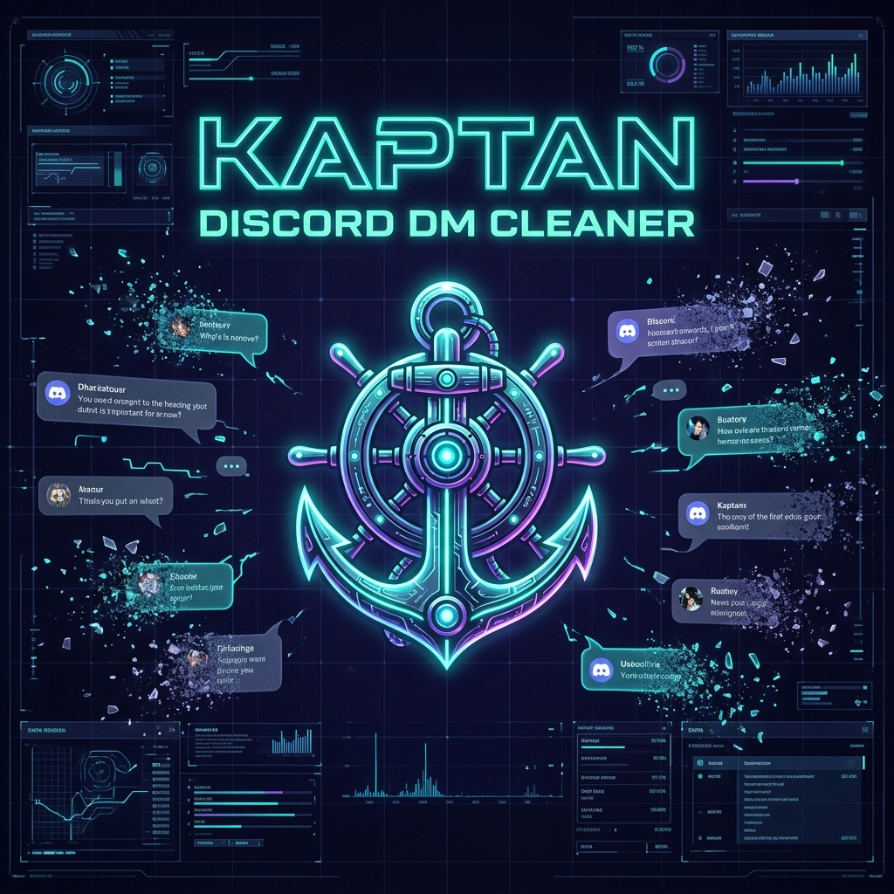

# Kaptan Discord DM Cleaner ⚓

  

  
  
  
  

[TR] Kaptan Discord DM Cleaner, Discord üzerindeki kendi DM geçmişinizi, sunucu kanalı mesajlarınızı ve hatta gizli/kapatılmış sohbetlerinizi güvenli, hızlı ve gelişmiş filtrelerle temizlemenizi sağlayan premium temalı bir Chrome eklentisidir.

[EN] Kaptan Discord DM Cleaner is a premium-themed Chrome extension that allows you to clean your direct message history, server channel messages, and hidden/closed DM conversations on Discord securely and fast, using advanced filters.

---

## Sürüm Notu / Release Notes (v5.1.0 Stable Release) ⚓

[TR] **Durum: Kararlı Sürüm / Yayınlandı (Stable & Released)**
- **Gelişmiş Filtreler & AI Desteği:** Resim, video, GIF, link, dosya tipi, karakter uzunluğu filtreleri ve AI filtreleme asistanı.
- **Gizli DM Bulucu:** Sohbet listesinden gizlenmiş veya kapatılmış DM kutularını bulma, geri getirme ve yönetme.
- **Toplu DM Temizleme (Multi-DM):** Birden fazla DM kutusunu aynı anda temizleyebilme, duraklatma ve kaldığı yerden devam edebilme.
- **Hayalet Modu (Ghost Mode):** Güvenlik için insan taklidi yapan dinamik gecikme süreleri (1.2s - 2.5s jitter).
- **Raporlama & Yedekleme:** Silinmeden önce sohbet geçmişini yedekleme ve sonrasında HTML/Markdown rapor indirme.
- **Storage Katmanı:** Güvenli storage wrapper, workspace migration ve bozuk localStorage kurtarma mekanizması tamamlandı.
- **Matrix Paskalya Yumurtası:** Konami kodu ile Matrix yağmuru efekti.
- **Test Suite:** Tarayıcı ortamında koşan 7 test suite ve 30 test case'in tamamı başarıyla geçmektedir.

[EN] **Status: Stable Release & Published**
- **Advanced Filters & AI Support:** Filter by images, videos, GIFs, links, document types, character length, or use the natural language AI filtering assistant.
- **Hidden DM Finder:** Scan, recover, and manage closed or hidden DM channels directly from your dashboard.
- **Bulk DM Deletion (Multi-DM):** Clear multiple conversations sequentially, pause/resume, and recover from failures with storage-persisted session states.
- **Stealth/Ghost Mode:** Human-like jitter delays (1.2s - 2.5s) to protect account safety during automated actions.
- **Report & Backup:** Backup chat history as a text file before clearing, and generate polished HTML/Markdown activity reports.
- **Storage Layer:** Robust storage wrapper, automatic schema migration, and localStorage corruption recovery.
- **Matrix Easter Egg:** Konami code triggered cyberpunk Matrix digital rain effect.
- **Test Suite:** Thoroughly validated with a browser-based test harness featuring 7 test suites and 30 active cases passing successfully.

---

## Özellikler / Features 🚀

- **Gelişmiş Filtreler (Advanced Filters):** Sadece resimler, videolar, GIF'ler, bağlantılar (linkler), belirli kelimeler veya karakter uzunluğuna göre mesaj silme.
- **Gizli DM Bulucu (Hidden DM Finder):** Kapatılmış veya gizlenmiş sohbet kutularını listeleme ve yönetme.
- **Toplu DM Temizleme (Clear All DMs):** Birden fazla DM kutusunu sırayla otomatik temizleme ve yarıda kalırsa kaldığı yerden devam edebilme altyapısı (oturum kaydetme).
- **Hayalet Modu (Stealth/Ghost Mode):** Hesap güvenliğini korumaya yönelik, insan taklidi yapan dinamik gecikme süreleri (1.2s - 2.5s jitter).
- **Yerel İstatistik ve Analiz (Local Analytics):** Konuşmadaki kelime bulutu, en çok yazışan kullanıcılar ve yıllara göre mesaj grafiklerini içeren detaylı canlı panel.
- **Aktivite Raporu (Activity Report):** Silinen mesaj istatistiklerini ve tahmini veri hacmini içeren indirilebilir şık HTML/Markdown raporları.
- **Matrix Paskalya Yumurtası (Easter Egg):** `↑ ↑ ↓ ↓ ← → ← → B A` Konami kodunu girerek aktifleştirilebilen Matrix yağmuru efekti.

---

## Kurulum / Installation 📦

### [TR] Adım Adım Kurulum
1. Bu depoyu ZIP olarak indirin ve bir klasöre çıkartın.
2. Google Chrome (veya Brave, Edge, Opera) tarayıcınızı açın.
3. Adres çubuğuna `chrome://extensions/` yazın ve gidin.
4. Sağ üst köşede yer alan **"Gelişmiş Mod"** (Developer Mode) seçeneğini aktif hale getirin.
5. Sol üstte çıkan **"Paketlenmiş eklenti yükle"** (Load Unpacked) butonuna tıklayın.
6. Depodan çıkarttığınız klasörü seçin.
7. Discord sekmesini yenilediğinizde sağ üst köşede Kaptan paneli açılacaktır!

### [EN] Step by Step Installation
1. Download this repository as a ZIP and extract it to a folder.
2. Open your Google Chrome (or Brave, Edge, Opera) browser.
3. Navigate to `chrome://extensions/` in the address bar.
4. Enable **"Developer Mode"** in the top right corner.
5. Click **"Load unpacked"** in the top left corner.
6. Select the folder where you extracted this repository.
7. Refresh your Discord tab, and the Kaptan control panel will appear in the top right corner!

---

## Yasal Uyarı / Legal Disclaimer ⚠️

- **TR:** Bu araç bağımsız bir yardımcı yazılımdır ve Discord Inc. ile resmi bir ortaklığı, yetkilendirmesi veya sponsorluk ilişkisi bulunmamaktadır. Eklentinin kullanımından doğabilecek tüm sorumluluk (hesap kısıtlamaları vb.) kullanıcıya aittir.
- **EN:** This tool is an independent helper application and does not have any official affiliation, authorization, or partnership with Discord Inc. The user bears all responsibility for any consequences (including account restrictions) that may arise from using this extension.

---

## Gizlilik Politikası / Privacy First 🔒

- **TR:** Kaptan Discord DM Cleaner, tüm işlemleri yerel olarak kullanıcının tarayıcısında gerçekleştirir. Hiçbir kişisel veri, kimlik doğrulama bilgisi veya mesaj içeriği harici sunuculara gönderilmez.
- **EN:** Kaptan Discord DM Cleaner performs all operations locally inside the user's browser. No personal data, authentication credentials, or message contents are transmitted to external servers.

---

## Lisans / License 📄

- **TR:** Bu proje ticari olmayan bireysel kullanım lisansına (EULA) tabidir. Kaynak kodlarının kopyalanması, değiştirilmesi, dağıtılması ve tersine mühendislik yapılması yasaktır. Detaylar için [LICENSE](LICENSE) dosyasına göz atabilirsiniz.
- **EN:** This project is licensed under a proprietary End User License Agreement (EULA). Copying, modifying, redistributing, or reverse engineering the software is strictly prohibited. See the [LICENSE](LICENSE) file for more details.
"# kaptan-dm-cleaner" 
"# kaptan-dm-cleaner" 
